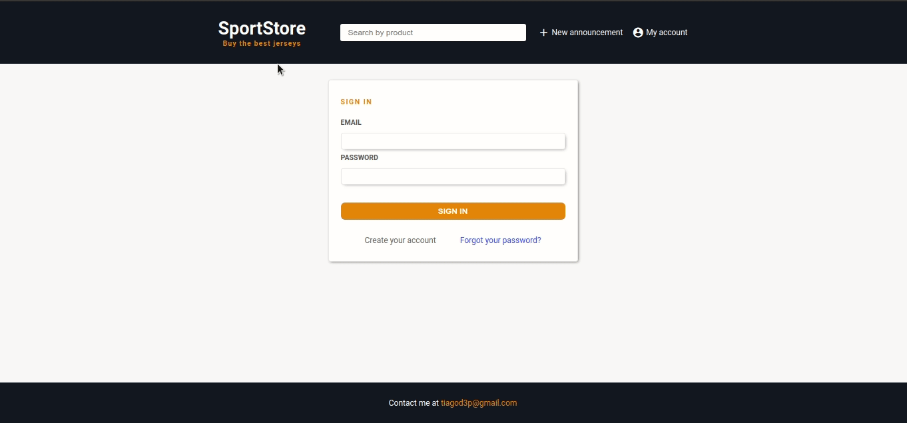
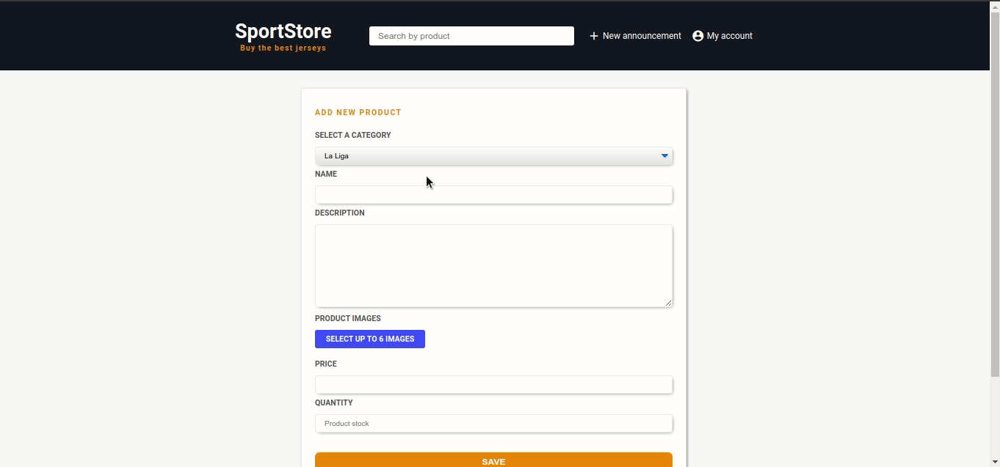

<p align="center">
  <a href="https://www.twitter.com/tiagod3p/">
    
  </a>
  
  <a href="https://github.com/tiagod3p/sportstore/commits/master">
    
  </a>
    
   

   <a href="https://github.com/tiagod3p/sportstore/stargazers">
    
  </a>

  <a href="https://www.linkedin.com/in/tiagovidaldepaula/">
    
  </a>
</p>
<h1 align="center">
    
</h1>

<h4 align="center"> 
	🚧 Sport Store :soccer: In progress... 🚀 🚧
</h4>

<p align="center">
 <a href="#-about-the-project">About</a> •
 <a href="#%EF%B8%8F-features">Features</a> •
 <a href="#-layout">Layout</a> • 
 <a href="#-how-it-works">How it works</a> • 
 <a href="#-tech-stack">Tech Stack</a> • 
 <a href="#-how-to-contribute">How to contribute</a> • 
 <a href="#-author">Author</a> • 
 <a href="#user-content--license">License</a>
</p>


## 💻 About the project

:soccer: Sport Store is an ecommerce based in websites like ebay, where you can create an account and buy or sell your only products. In this case, Sport Store is focused in sell products related to sports, like teams jersey.

---

## ⚙️ Features

- [x] Register
- [x] Login
- [x] Dashboard
- [x] Forgot password system
- [x] Search page
- [x] Edit and delete account
- [x] Create a new product
- [x] Edit and delete a product
- [x] See other users products
- [ ] Buy a product

---

## 🎨 Layout

<p align="center" style="display: flex; align-items: flex-start; justify-content: center;">
  
                         
  
</p>

<p align="center" style="display: flex; align-items: flex-start; justify-content: center;">  
  
</p>

---

## 🚀 How it works

### Pre-requisites

Before you begin, you will need to have the following tools installed on your machine:
[Git](https://git-scm.com), [Node.js](https://nodejs.org/en/) and [PostgreSQL](https://www.postgresql.org/). 
In addition, it is good to have an editor to work with the code like [VSCode](https://code.visualstudio.com/)


#### 🧭 Running the web application

```bash

# Clone this repository
$ git clone https://github.com/tiagod3p/sportstore.git

# Access the project folder in your terminal
$ cd sportstore

# Create a database in POSTGRESQL with the structure in the file DATABASE.sql
# Configure your db infos in the file src/config/db.js

# Install the dependencies
$ npm install

# Run the application in development mode
$ npm start

# The application will open on the port: 5050 - go to http://localhost:5050

```

---

## 🛠 Tech Stack

The following tools were used in the construction of the project:

#### **Website**
-   **[Javascript](https://www.javascript.com/)**
-   **[Node.js](https://nodejs.org/)**
-   **[Express](https://expressjs.com/)**
-   **[PostgreSQL](https://www.postgresql.org/)**

---

## 💪 How to contribute

1. Fork the project.
2. Create a new branch with your changes: git checkout -b my-feature
3. Save your changes and create a commit message telling you what you did: git commit -m" feature: My new feature "
4. Submit your changes: git push origin my-feature
5. Open a pull request!

When the merge of your pull request is done, you can delete your branch.

You can send me as many PR's as you want, I will be honored to review and accept them!

---

## 🦸 Author


 
 <br />
 <sub><b>Tiago Vidal</b></sub>
 <br />

[](https://twitter.com/tiagod3p) [](https://www.linkedin.com/in/tiagovidaldepaula/) 
[](mailto:tiagod3p@gmail.com)

---

## 📝 License

This project is under the license MIT.

Made with ❤️ by Tiago Vidal 👋🏽 [Get in touch!](https://www.linkedin.com/in/tiagovidaldepaula/)

---
